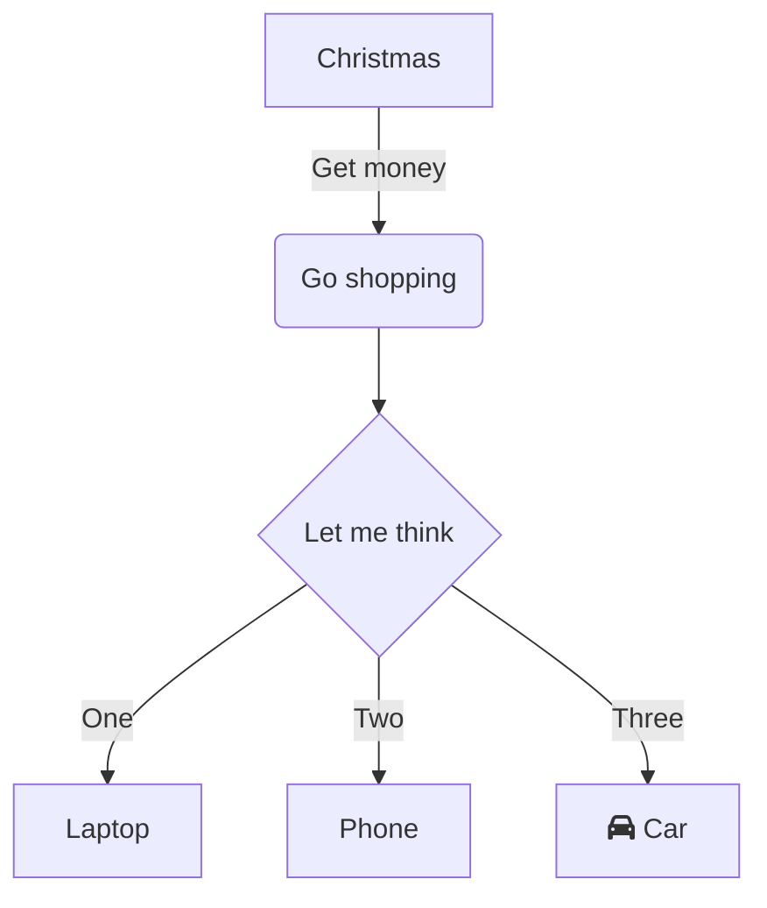

# Paragraphs

Any line with blank lines before and after it is a paragrah, consequent lines
are joined.

You need a blank line for a new paragraph.

# Separators

---

# Heading (h1)

## Heading (h2)

### Heading (h3)

#### Heading (h4)

##### Heading (h5)

# Text decoration

**This is bold text**

__This is bold text__

*This is italic text*

_This is italic text_

~~This is dashed text~~

<https://ntrrg.dev>

[This is a link](https://ntrrg.dev)

[This is a link with a title](https://ntrrg.dev "This is the title!").

[ntweb]: https://ntrrg.dev

[ntweb][]

[My site][ntweb]

<abbr title="Graphics Interchange Format">GIF</abbr>.

H<sub>2</sub>O

X<sup>n</sup> + Y<sup>n</sup> = Z<sup>n</sup>

<kbd>Ctrl</kbd> + <kbd>Alt</kbd> + <kbd>Delete</kbd>

Miguel Angel (<mark>ntrrg</mark>) Rivera Notararigo.

# Lists

* Create a list by starting a line with `+`, `-`, or `*`
* Sub-lists are made by indenting 2 spaces:
  * This is a sublist
* And everything become normal again

1. This is
2. an ordered
3. list

This
: is a definition list.

Term:
: definition, you can add the `:` in the term.

# Quotes

This paragraph has a footnote[^1].

[^1]: And here is the footnote.

> Block quotes are
> written like so.
>
> They can span multiple paragraphs, if you like.
>
> And **Markdown**!.
>
> -- The Author

# Tables

| Heading | Another heading |
| ------- | --------------- |
| text    | text            |
| text    | text            |
| text    | text            |

| Heading | Another heading |
| :-----: | :-------------: |
|  text   |      text       |
|  text   |      text       |
|  text   |      text       |

| Heading | Another heading |
| ------: | --------------: |
|    text |            text |
|    text |            text |
|    text |            text |

# Images


# Code

Inline `code`.

```go
package main

import "fmt"

func main() {
  fmt.Println("hello, world")
}
```

```go {linenos=true,hl_lines=["1", "5-7"],linenostart=1}
package main

import "fmt"

func main() {
  fmt.Println("hello, world")
}
```

# Shortcodes

## TOC

```
< toc [title=TITLE] [open=true|false] >
```

**Parameters:**



{}
TOC title.
{}

{}
Opens the TOC block by default.
{}



**Examples:**



```html
<details class="toc">
  <summary class="toc-title"><strong>Table of Contents</strong></summary>

  <nav id="TableOfContents">
    <ul>
      <li><a href="#paragraphs">Paragraphs</a></li>
      <li><a href="#separators">Separators</a></li>
      <li><a href="#heading-h1">Heading (h1)</a>
        <ul>
          <li><a href="#heading-h2">Heading (h2)</a>
            <ul>
              <li><a href="#heading-h3">Heading (h3)</a>
                <ul>
                  <li><a href="#heading-h4">Heading (h4)</a>
                    <ul>
                      <li><a href="#heading-h5">Heading (h5)</a></li>
                    </ul>
                  </li>
                </ul>
              </li>
            </ul>
          </li>
        </ul>
      </li>
      <li><a href="#text-decoration">Text decoration</a></li>
      <li><a href="#lists">Lists</a></li>
      <li><a href="#quotes">Quotes</a></li>
      <li><a href="#tables">Tables</a></li>
      <li><a href="#images">Images</a></li>
      <li><a href="#code">Code</a></li>
      <li><a href="#shortcodes">Shortcodes</a>
        <ul>
          <li><a href="#toc">TOC</a></li>
          <li><a href="#taks-list">Task List</a></li>
          <li><a href="#images-1">Images</a></li>
          <li><a href="#figures">Figures</a></li>
          <li><a href="#notes">Notes</a></li>
          <li><a href="#details">Details</a></li>
          <li><a href="#math-formulas">Math formulas</a></li>
          <li><a href="#charts">Charts</a></li>
          <li><a href="#imports">Imports</a></li>
          <li><a href="#cards">Cards</a></li>
          <li><a href="#snippets">Snippets</a></li>
          <li><a href="#go-playground">Go Playground</a></li>
          <li><a href="#params">Params</a></li>
        </ul>
      </li>
    </ul>
  </nav>
</details>
```

## Task List

```
< task-list >
CONTENT
< /task-list >
```

**Parameters:**



{}
Unordered list prefixed by `* [ ]` for unchecked elements and `* [x]` for
checked elements.
{}



**Examples:**


* [ ] This is
* [x] a task list


## Images

```
< img src=URL [alt=ALTERNATIVE_TEXT] [lazy=true|false] \
    [class=CLASSES] [style=STYLES] >
```

**Parameters:**



{}
Image URL.
{}

{}
Image alternative text.
{}

{}
Generates lazy loading friendly `img` HTML tags with `data-src` attribute and
`lazy-load` class.
{}

{}
Image `class` HTML attribute.
{}

{}
Image `style` HTML attribute.
{}



**Examples:**

Inline image with 

```html

```

---



```html

```

---



```html

```

## Figures

```
< figure src=URL [alt=ALTERNATIVE_TEXT] [lazy=true|false] \
    [imgclass=CLASSES] [imgstyle=STYLES] [class=CLASSES] [style=STYLES] >
```

**Parameters:**



{}
Image URL.
{}

{}
Image alternative text.
{}

{}
Figure caption.
{}

{}
Generates lazy loading friendly `img` HTML tags with `data-src` attribute and
`lazy-load` class.
{}

{}
Image `class` HTML attribute.
{}

{}
Image `style` HTML attribute.
{}

{}
Figure `class` HTML attribute.
{}

{}
Figure `style` HTML attribute.
{}



**Examples:**



```html
<figure>
  

  <figcaption>
    Mérida, Venezuela.
  </figcaption>
</figure>
```

---



```html
<figure style="text-align: center">
  

  <figcaption>
    <a href="https://ntrrg.dev" target="_blank" rel="noopener noreferrer">
      ntrrg
    </a>
  </figcaption>
</figure>
```

## Notes

```
% note [TITLE] %
CONTENT
% /note %

% note [title=TITLE] [class=CLASSES] %
CONTENT
% /note %
```

**Parameters:**



{}
Custom title.
{}

{}
Note `class` HTML attribute.
{}

{}
Note content.
{}



**Examples:**

{}
This is a note.
{}

```html
<div class="note">
  <div class="note-header">Note</div>

  <div class="note-body">
    <p>This is a note.</p>
  </div>
</div>
```

---

{}
This is a note with a **custom title**.
{}

```html
<div class="note">
  <div class="note-header">My title</div>

  <div class="note-body">
    <p>This is a note with a <strong>custom title</strong>.</p>
  </div>
</div>
```

## Details

```
% details [SUMMARY] %
CONTENT
% /details %

% details [summary=SUMMARY] [open=true|false] [class=CLASSES] %
CONTENT
% /details %
```

**Parameters:**



{}
Details summary. Supports Markdown.
{}

{}
Opens the details block by default.
{}

{}
Details `class` HTML attribute.
{}

{}
Details block content.
{}



**Examples:**

{}
This is a details block.
{}

```html
<details class="details">
  <p>This is a details block.</p>
</details>
```

---

{}
This is a details block with a **custom summary**.
{}

```html
<details class="details">
  <summary>Custom summary</summary>
  <p>This is a details block with a <strong>custom summary</strong>.</p>
</details>
```

---

{}
This is a details block with `open=true`.
{}

```html
<details open="open" class="details">
  <p>This is a details block with <code>open=true</code>.</p>
</details>
```

## Wrapping

```
% wrap CLASSES %
CONTENT
% /wrap %

% wrap [id=ID] [class=CLASSES] [style=STYLES] %
CONTENT
% /wrap %
```

**Parameters:**



{}
Wrapper `id` HTML attribute.
{}

{}
Wrapper `class` HTML attribute.
{}

{}
Wrapper `style` HTML attribute.
{}

{}
Wrapped content.
{}



**Examples:**

{}
Lorem ipsum dolor sit amet, consectetur adipiscing elit, sed do eiusmod tempor
incididunt ut labore et dolore magna aliqua. Ut enim ad minim veniam, quis
nostrud exercitation ullamco laboris nisi ut aliquip ex ea commodo consequat.
Duis aute irure dolor in reprehenderit in voluptate velit esse cillum dolore eu
fugiat nulla pariatur. Excepteur sint occaecat cupidatat non proident, sunt in
culpa qui officia deserunt mollit anim id est laborum.
{}

```html
<div class="center small muted">
  <p>
    Lorem ipsum dolor sit amet, consectetur adipiscing elit, sed do eiusmod
    tempor incididunt ut labore et dolore magna aliqua. Ut enim ad minim
    veniam, quis nostrud exercitation ullamco laboris nisi ut aliquip ex ea
    commodo consequat.  Duis aute irure dolor in reprehenderit in voluptate
    velit esse cillum dolore eu fugiat nulla pariatur. Excepteur sint occaecat
    cupidatat non proident, sunt in culpa qui officia deserunt mollit anim id
    est laborum.
  </p>
</div>
```

---



{}

{}

{}
This is a **Markdown** text.
{}







```html
<div style="display: flex">
  <div class="col">
    <p></p>
  </div>

  <div class="col">
    <p>This is a <strong>Markdown</strong> text.</p>
  </div>

  <div class="col">
    
  </div>
</div>
```

## Math formulas

```
< math >
CONTENT
< /math >
```

**Parameters:**



{}
Math syntax. See http://docs.mathjax.org/en/latest/basic/mathematics.html for
more information about the syntax.
{}



**Examples:**

This is text with inline math \\(\sum\_{n=1}^{\infty} 2^{-n} = 1\\)
and this is a math block:


$$
\sum\_{n=1}^{\infty} 2^{-n} = 1
$$


## Charts

```
< mermaid [CAPTION] >
SOURCE_CODE
< /mermaid >

< mermaid [caption=CAPTION] [font=FONT_FAMILY] [theme=THEME] \
    [code=true|false] [class=CLASSES] >
SOURCE_CODE
< /mermaid >
```

**Parameters:**



{}
Chart caption. Supports Markdown.
{}

{}
Chart font family. This works only the first time the shortcode is called,
after that, every chart will use this value.
{}

{}
Chart theme. This works only the fist time the shortcode is called, after that,
every chart will use this value.
{}

{}
Displays the chart source code.
{}

{}
Figure `class` HTML attribute.
{}

{}
Mermaid source code.
{}



**Examples:**





```html
<figure class="mermaid-chart">
  <div class="mermaid-output">...</div>
  <figcaption>Chart caption.</figcaption>
  <div class="mermaid-code" style="display: none">...</div>
</figure>
```

---





```html
<figure class="mermaid-chart">
  <div class="mermaid-output">...</div>
  <div class="mermaid-code">...</div>
</figure>
```

## Imports

```
< import PATH >
```

**Parameters:**



{}
File path. It may be a relative path to the current file or an absolute path
from the project root.
{}



**Examples:**



## Cards

```
< card SLUG >
```

**Parameters:**



{}
Relative page path from the `content` directory.
{}



**Examples:**



```html
<article class="page-card has-image">
  <a href="/en/blog/demo-page/">
    
  </a>

  <header>
    <strong class="page-card-title">
      <a href="/en/blog/demo-page/">Demo page</a>
    </strong>

    <p class="page-card-description">
        This is a demo page to see the Markdown styles.
    </p>
  </header>

  <section class="page-card-metadata">
    <div>
      <strong>Published:</strong>

      <time datetime="2028/07/05 18:35:00 -04:00">
        2028/07/05 18:35:00 -04:00
      </time>
    </div>

    <div>
      <strong>Modified:</strong>

      <time datetime="2028/07/05 19:35:00 -04:00">
        2028/07/05 19:35:00 -04:00
      </time>
    </div>

    <div>
      <strong>Authors:</strong>
      <a href="/en/authors/john/">John Doe</a>
    </div>

    <div>
      <strong>Series:</strong>
      <a href="/en/series/demo/">Demo serie</a>
    </div>

    <div>
      <strong>Tags:</strong>
      <a href="/en/tags/tag1/">#tag1</a>
      <a href="/en/tags/tag2/">#tag2</a>
      <a href="/en/tags/tag3/">#tag3</a>
    </div>
  </section>
</article>
```

## Snippets

```
< snippets [PATH] >

< snippets [path=PATH] [hl=SYNTAX_HIGHLIGHT] \
    [foldable=true|false [name=FILE_NAME] [open=true|false]] >
```

**Parameters:**



{}
Snippet path. It may be a relative path to the current file or an absolute path
from the project root.
{}

{}
Syntax highlight mode.
{}

{}
Creates a foldable snippet.
{}

{}
File name to display in the foldable menu.
{}

{}
Opens the foldable snippet.
{}



**Examples:**



---

{{< snippet path="files/hello.go" hl="go {linenos=true,hl_lines=[\"1\", \"5-7\"],linenostart=1}" foldable=true name="main.go" open=true >}}

```html
<details class="foldable-snippet" open="open">
  <summary><code>main.go</code></summary>
  <div class="highlight">...</div>
</details>
```

## Go Playground

```
< go-playground >
SOURCE_CODE
< /go-playground >

< go-playground >
[SAMPLE]

"--- PLAYGROUND ---"

SOURCE_CODE
< /go-playground >

< go-playground ID >
[SAMPLE]
< /go-playground >

```

**Parameters:**



{}
Go Playground snippet identifier. Useful for linking snippets that already
exist.
{}

{}
Source code to display.
{}

{}
Source code to send to the Go Playgroud.
{}



**Examples:**


```go
package main

import "fmt"

func main() {
  fmt.Println("hello, world")
}
```


---


```go
fmt.Println("hello, world")
```

--- PLAYGROUND ---

```go
package main

import "fmt"

func main() {
  fmt.Println("hello, world")
}
```


---

The first line is the package name

```go
package main
```

Next, the external packages used in this program

```go
import "fmt"
```

Finally the program body

```go
func main() {
  fmt.Println("hello, world")
}
```


--- PLAYGROUND ---

```go
package main

import "fmt"

func main() {
  fmt.Println("hello, world")
}
```


---


```go
fmt.Println("hola, mundo")
```


## Params

```
< params >
% param [name=NAME] [type=DATA_TYPE] [default=DEFAULT_VALUE] %
DESCRIPTION
% /param %
< /params >
```

**Parameters:**



{}
Parameter name.
{}

{}
Parameter data type.
{}

{}
Parameter default value.
{}

{}
Parameter description.
{}



**Examples:**



{}
String variable.
{}

{}
Numeric variable.
{}

{}
Boolean variable.
{}

{}
Short CLI flag.
{}

{}
Long CLI flag.
{}

{}
Double CLI flags.
{}

{}
MS-DOS flag.
{}



```html
<div class="params">
  <div class="param">
    <div class="param-header">
      <span class="param-name"><code>s</code></span>
      - <span class="param-type">String</span>
    </div>

    <div class="param-body">
      <p>String variable.</p>
    </div>
  </div>

  <div class="param">
    <div class="param-header">
      <span class="param-name"><code>n</code></span>
      - <span class="param-type">Integer</span>
    </div>

    <div class="param-body">
      <p>Numeric variable.</p>
    </div>
  </div>

  <div class="param">
    <div class="param-header">
      <span class="param-name"><code>b</code></span>
      - <span class="param-type">Boolean</span>
      <span class="param-default">(<code>true</code>)</span>
    </div>

    <div class="param-body">
      <p>Boolean variable.</p>
    </div>
  </div>

  <div class="param">
    <div class="param-header">
      <span class="param-name"><code>-f</code></span>
      - <span class="param-type">String</span>
    </div>

    <div class="param-body">
      <p>Short CLI flag.</p>
    </div>
  </div>

  <div class="param">
    <div class="param-header">
      <span class="param-name"><code>--flag</code></span>
      - <span class="param-type">String</span>
    </div>

    <div class="param-body">
      <p>Long CLI flag.</p>
    </div>
  </div>

  <div class="param">
    <div class="param-header">
      <span class="param-name"><code>-f | --flag</code></span>
      - <span class="param-type">String</span>
    </div>

    <div class="param-body">
      <p>Double CLI flags.</p>
    </div>
  </div>

  <div class="param">
    <div class="param-header">
      <span class="param-name"><code>/f</code></span>
      - <span class="param-type">String</span>
    </div>

    <div class="param-body">
      <p>MS-DOS flag.</p>
    </div>
  </div>
</div>
```

